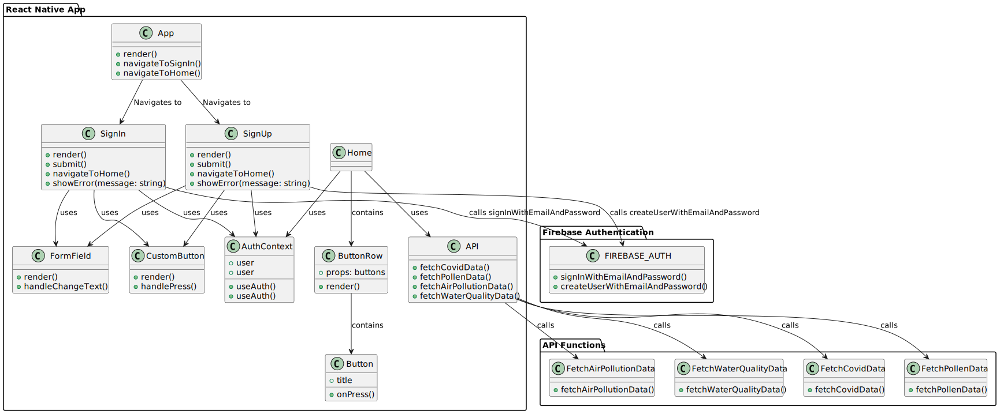

# IEC 62304 Software Architecture Desing
## Overview
The app architecture is designed as a modular system with well-defined components to support real-time data fetching, processing, and presentation while ensuring security and scalability.
This architecture adheres to the principles of Client-Server, and Layered Architecture, enabling efficient integration of multiple data sources and scalability for future
enhancements.

## High-level architecture diagram
> The diagram can be edited/generated from ./Architecture.plantuml 

## Key Components
1. User Interface (UI Layer)
   - Description: The primary interaction point for users to view environmental data, alerts, and submit information.
   - Technologies: React Native (for mobile)
   - Responsibilities:
     - Display real-time data.
     - Notify users about environmental risks.
     - Provide forms for submitting outbreak data.

2. Application Layer
   - Description: The bridge between the UI and backend services, handling user requests, business logic, and data presentation.
   - Technologies: React native, TypeScript, Firebase
   - Responsibilities:
     - Process user inputs and validate them.
     - Call APIs for environmental data.
     - Format data for the UI.
  
3. Middleware/API Gateway
   - Description: Manages API calls, security, and communication between the application and backend services.
   - Technologies: Expo
   - Responsibilities:
     - Handle authentication and authorization.
     - Validate API requests and responses.
     - Route requests to appropriate backend services.

4. Backend Services:
    - Microservices-Based Design for flexibility and scalability.
    - Description and Responsibilities:
      - Data Aggregation Service:
        - Fetches real-time data from APIs (air and water quality).
        - Normalizes and processes data for consistency.
      - Alert Notification Service:
        - Monitors data thresholds (e.g., PM2.5 > 35 µg/m³).
        - Generates and sends user alerts.
      - User Management Service:
        - Handles user authentication, profile, through Firebase

5. Data Sources and Sensors APIs
   - Description: Integrates with external APIs or IoT sensors for data collection.
   - Examples:
     - Air Quality: APIs like OpenWeatherMap.
     - Water Quality: Historical data.
   - Responsibilities:
     - Provide real-time environmental data.
     - Ensure data accuracy and reliability.

6. Security Features:
   - Encryption and Authentication: Firebase.
   - Access Control:
     - Role-based access control (e.g., users vs. admins).

   